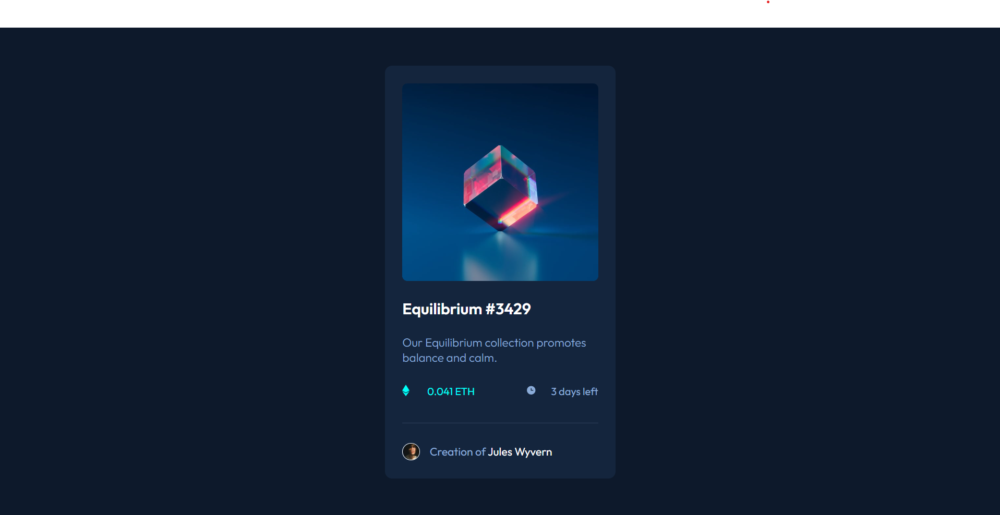

# Frontend Mentor - NFT preview card component solution

This is a solution to the [NFT preview card component challenge on Frontend Mentor](https://www.frontendmentor.io/challenges/nft-preview-card-component-SbdUL_w0U). Frontend Mentor challenges help you improve your coding skills by building realistic projects. 

## Table of contents

- [Overview](#overview)
  - [The challenge](#the-challenge)
  - [Screenshot](#screenshot)
  - [Links](#links)
- [My process](#my-process)
  - [Built with](#built-with)
  - [What I learned](#what-i-learned)
  - [Continued development](#continued-development)
  - [Useful resources](#useful-resources)
- [Author](#author)


## Overview

### The challenge

Users should be able to:

- View the optimal layout depending on their device's screen size
- See hover states for interactive elements

### Screenshot




### Links

- Solution URL: [https://eliyahubelay.github.io/Frontend-Mentor3/]

## My process

### Built with

- Semantic HTML5 markup
- Flexbox
- CSS Grid


### What I learned

I sharping my design skills and maneged to combine more and more properties at once

css
```css
.card_container .equilibrium_pic:hover ~ .icon_view{
    display: block;
}
```


### Continued development

I want to keep working more on my block & inline HTML elements and the CSS ways to overcome that,
more than that I want to keep develope my HTML structure knowlege in the right way.


### Useful resources

- [https://developer.mozilla.org/en-US/] - This helped me for deeper understanding of different containers in HTML their right structure and their properties.
- [https://www.freecodecamp.org/news] - There is an amazing articles which helped me discovere more and more CSS properties.


## Author

- Website - Will be one soon
- Frontend Mentor - [https://www.frontendmentor.io/profile/EliyahuBelay]
- Twitter - [https://twitter.com/eliyahu_belay]

